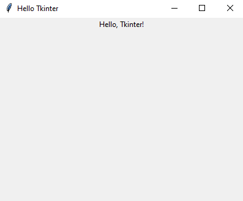

# Tkinter

## What is Tkinter:
**Tkinter** is the standard Python library used for creating graphical user interfaces (GUIs).  
It provides a simple way to create windows, buttons, text fields, labels, and other common GUI components.  

### Key Features of Thinter:
1. **Cross-platform:** Works on Windows, macOS, and Linux.
2. **Lightweight:** Simple and easy to learn, making it a good choice for small applications.
3. **Widgets:** It provides various widgets like buttons, labels, frames, text boxes, etc.
4. **Event-driven programming:** You can bind functions to events like button clicks, key presses, etc.

### Basic Example:
```python
import tkinter as tk

# Create the main window
root = tk.Tk()

# Set window title
root.title("Hello Tkinter")

# Set window size
root.geometry('400x300')

# Create a label widget
label = tk.Label(root, text="Hello, Tkinter!")
label.pack()

# Run the application
root.mainloop()
```
**The result:**


### First:
First thing you need to install ``tkinter``,  
to install it run: ``pip install tkinter`` in your terminal/cmd.

### After that:
in python file import the library: ``import tkinter as tk``.

## Learn for free:
This is the best video i found in the internet: [](https://youtu.be/mop6g-c5HEY?si=cfx5QiAHJuCtQWUE)

### That's it for today.
